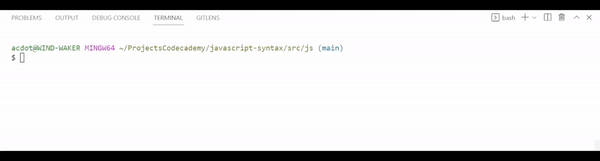

# 🎞Movie Message Generator🎞

## Description

The purpose of this project was to demonstrate my knowledge of JavaScript (JS) syntax by creating a random message generator.

## Features

Generates a movie message including:

- Movie Quote of the Day with Quotee
- Movie Genre of the Day
- Movie Title of the Day



## How to use

### Using Chrome

1. Open a new tab to a blank page. (type "about:blank" as the url)
2. Open the JavaScript console with Chrome DevTools (ctrl + shift + j on Windows)
3. Copy the "[generate-message-with-data.js](https://github.com/adamdoty/message-generator/blob/main/src/js/generate-message-with-data.js)" file using GitHub's copy raw contents button.
4. Paste it into the Chrome DevTools Console and run it. 👍

### Locally

1. [Clone the repository](https://docs.github.com/en/repositories/creating-and-managing-repositories/cloning-a-repository).
2. Make sure you have [Node.js](https://nodejs.org/en/) installed and setup.
3. Run ```node generate-message.js``` in the terminal.

## Technologies

1. Node.js
2. ESLint VSCode extension

## Other Notes

I'm aware the size of this "project" is more suitable for a gist. However, exploration and the following additional features would not be possible in gist format:

- Practicing making thorough README.md documentation
- Learning how to import JSON data into a js file
- Figuring out how to use and configure ESLint
- Experimenting with project structure
